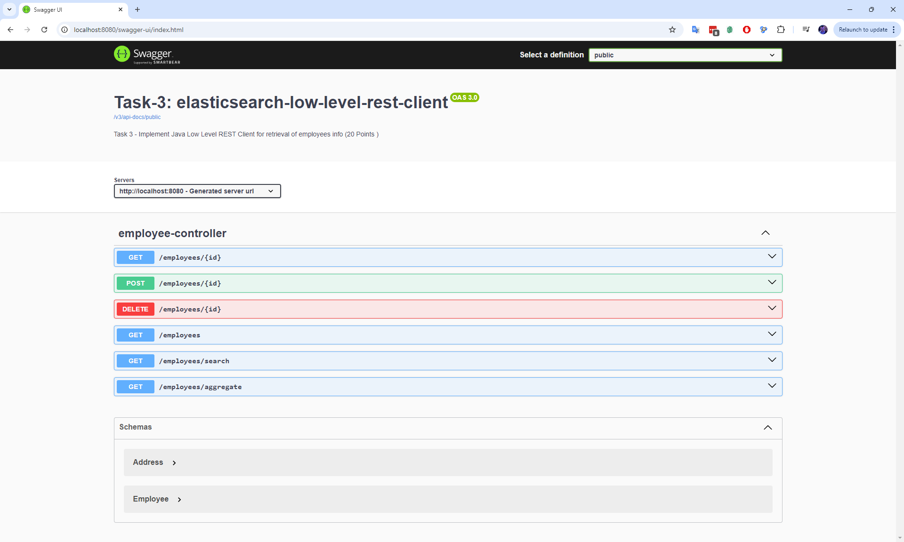

# jmp.nosql-and-search

# Module 3: Search Engines: Elasticsearch

## Elasticsearch Practical Tasks

## Task 3 - Implement Java Low Level REST Client for retrieval of employees info (20 Points )

[Java Low Level REST Client](https://www.elastic.co/guide/en/elasticsearch/client/java-api-client/current/java-rest-low.html)

    1. Get all employees.

    2. Get an employee by id.

    3. Create an employee providing id and employee data json.
    
    4. Delete an employee by its id.

    5. Search employees by any field. Field name and field value should be provided as http request parameters.
       Implement the endpoint and try to get all employees with Java skill. 
       Make choise between "Match" and "Term" query.

    6. Perform an aggregation by any numeric field with metric calculation. 
       Aggregation field, metric type and metric field should be provided as http request parameters.

    Implementation details:

    * Your Java application should contain controller, service and dto layers.
    * Use jackson ObjectMapper to serialize and deserialize documents to Employee Java instance.
    * Add Swagger to your application. 
    * Make screenshots of some requests/responses performed.

---

## Screenshots

### Main page

### 1. Get all employees.

### 2. Get an employee by id.

### 3. Create an employee providing id and employee data json.

### 4. Delete an employee by its id.

### 5. Search employees by any field.

### 6. Perform an aggregation by any numeric field with metric calculation.
