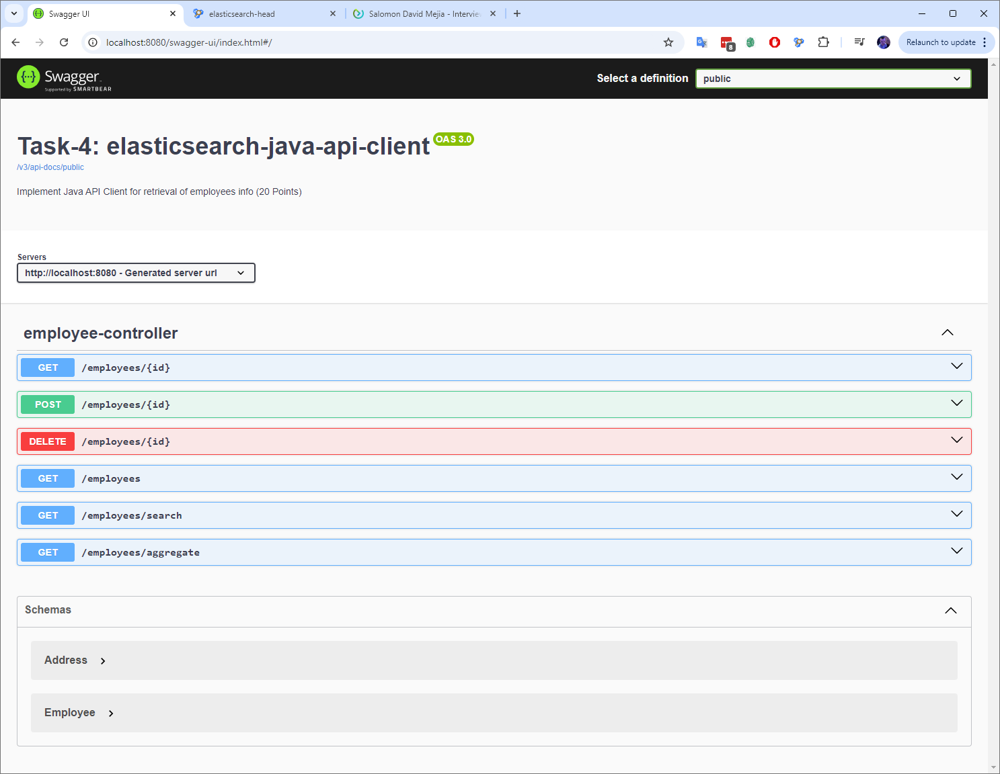
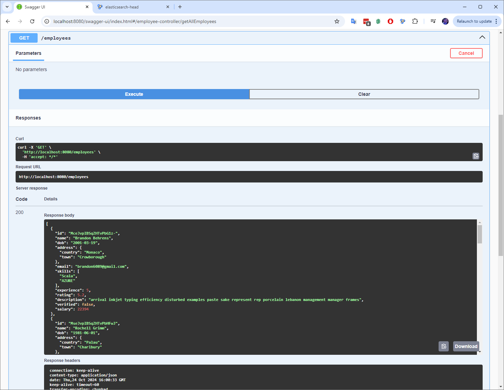
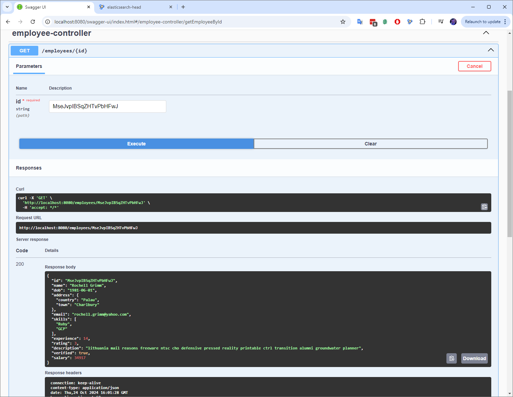
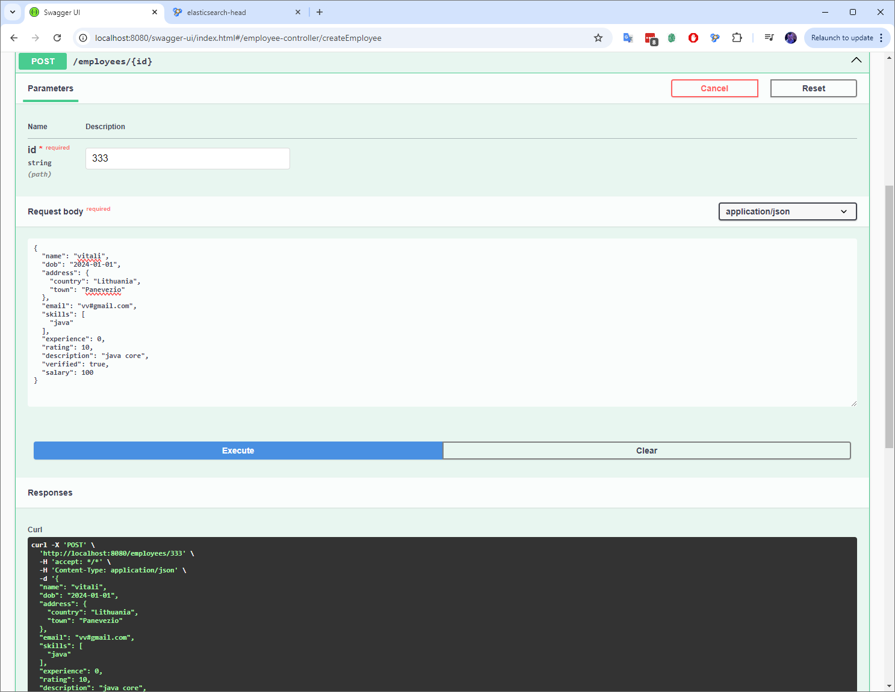
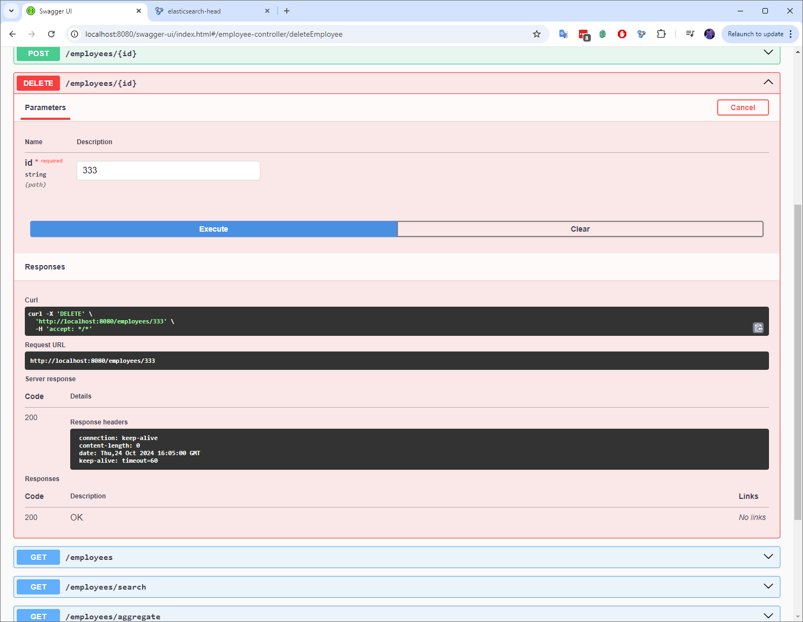
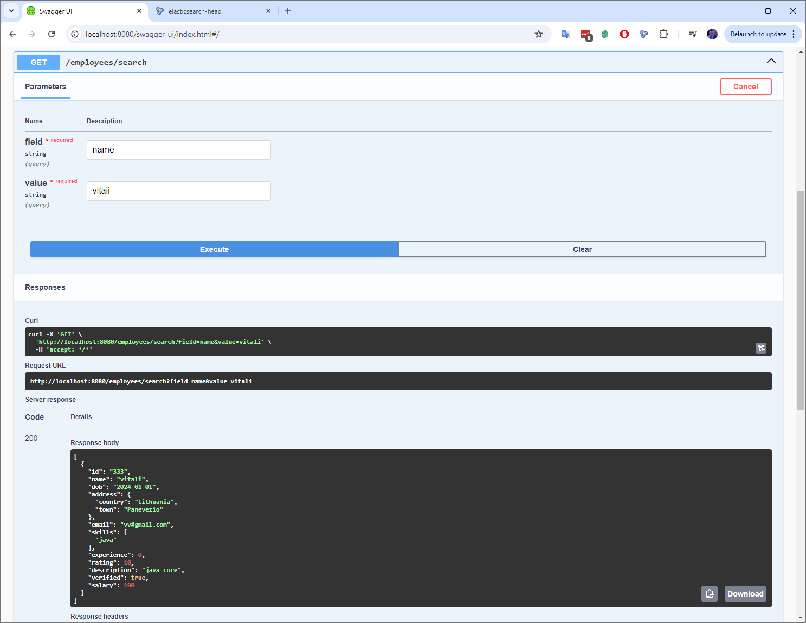
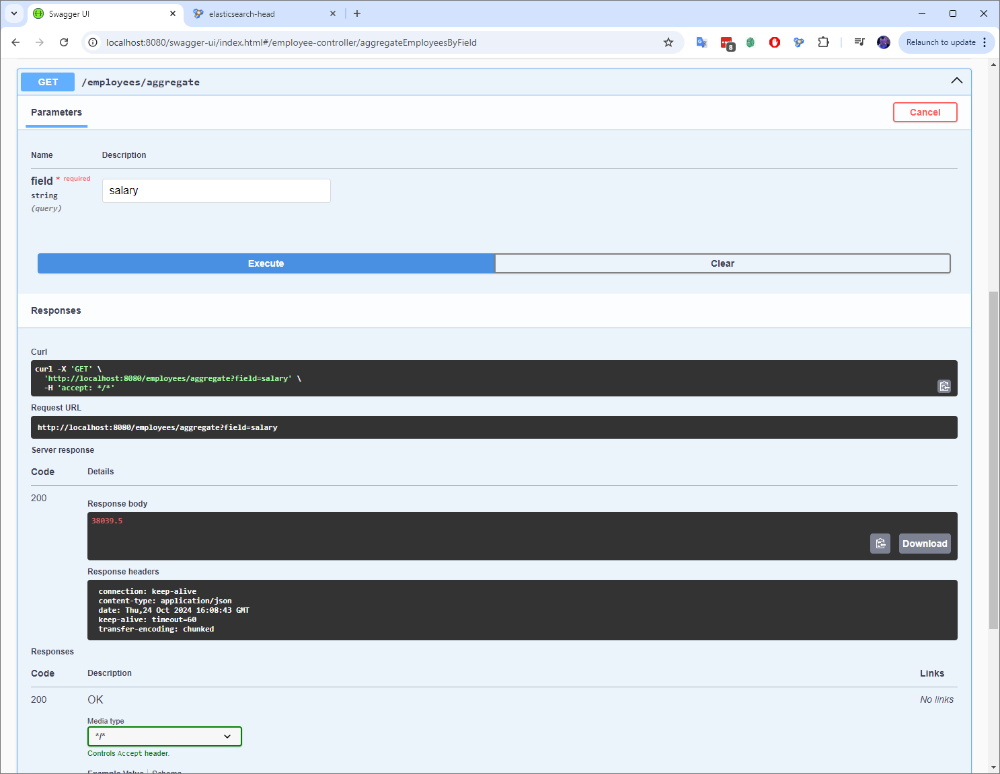

# jmp.nosql-and-search

# Module 3: Search Engines: Elasticsearch

## Elasticsearch Practical Tasks

## Task 4 - Implement Java API Client for retrieval of employees info (20 Points)

[Java API Client](https://www.elastic.co/guide/en/elasticsearch/client/java-api-client/current/introduction.html)

    Perform the same tasks as for Java Low REST Client.
    Note! You should use Java API Client, not the deprecated High Level Rest Client. They are similar, so don't mistake one for the other.
    What difficulties have you faced comparing to Java Low REST client?

---

## Screenshots

### Main page

### 1. Get all employees.

### 2. Get an employee by id.

### 3. Create an employee providing id and employee data json.

### 4. Delete an employee by its id.

### 5. Search employees by any field.

### 6. Perform an aggregation by any numeric field with metric calculation.

