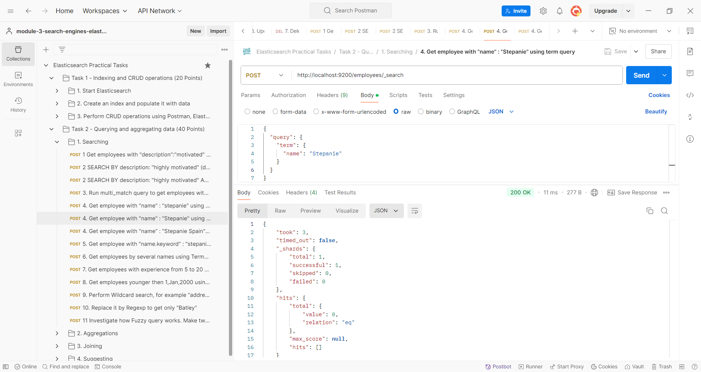

# jmp.nosql-and-search

# Module 3: Search Engines: Elasticsearch

## Elasticsearch Practical Tasks

## Task 1 - Indexing and CRUD operations (20 Points)


##### 1.	Start Elasticsearch
    Run bin/elasticsearch (or bin\elasticsearch.bat on Windows) 
    You can go to Elasticsearch Head (Chrome extention) to observe your cluster
    It runs on http://localhost:9200
    Check Elasticsearch health   GET http://localhost:9200/_cluster/health
    and Cluster stats            GET http://localhost:9200/_cluster/stats

<details>
<summary><strong>1 Check Elasticsearch health</strong></summary>

**Screenshot:**


#### GET http://localhost:9200/_cluster/health

**RESPONSE:**
```json
{
  "cluster_name": "docker-cluster",
  "status": "yellow",
  "timed_out": false,
  "number_of_nodes": 1,
  "number_of_data_nodes": 1,
  "active_primary_shards": 2,
  "active_shards": 2,
  "relocating_shards": 0,
  "initializing_shards": 0,
  "unassigned_shards": 2,
  "delayed_unassigned_shards": 0,
  "number_of_pending_tasks": 0,
  "number_of_in_flight_fetch": 0,
  "task_max_waiting_in_queue_millis": 0,
  "active_shards_percent_as_number": 50.0
}
```

</details>

<details>
<summary><strong>2 Cluster stats</strong></summary>

**Screenshot:**


#### GET http://localhost:9200/_cluster/stats

**RESPONSE:**
```json
{
  "_nodes": {
    "total": 1,
    "successful": 1,
    "failed": 0
  },
  "cluster_name": "docker-cluster",
  "cluster_uuid": "CG4d-O5JSOiXB9qlqaNSHQ",
  "timestamp": 1729663550119,
  "status": "yellow",
  "indices": {
    "count": 2,
    "shards": {
      "total": 2,
      "primaries": 2,
      "replication": 0.0,
      "index": {
        "shards": {
          "min": 1,
          "max": 1,
          "avg": 1.0
        },
        "primaries": {
          "min": 1,
          "max": 1,
          "avg": 1.0
        },
        "replication": {
          "min": 0.0,
          "max": 0.0,
          "avg": 0.0
        }
      }
    },
    "docs": {
      "count": 28,
      "deleted": 4
    },
    "store": {
      "size_in_bytes": 60542,
      "total_data_set_size_in_bytes": 60542,
      "reserved_in_bytes": 0
    },
    "fielddata": {
      "memory_size_in_bytes": 0,
      "evictions": 0,
      "global_ordinals": {
        "build_time_in_millis": 0
      }
    },
    "query_cache": {
      "memory_size_in_bytes": 0,
      "total_count": 0,
      "hit_count": 0,
      "miss_count": 0,
      "cache_size": 0,
      "cache_count": 0,
      "evictions": 0
    },
    "completion": {
      "size_in_bytes": 0
    },
    "segments": {
      "count": 4,
      "memory_in_bytes": 0,
      "terms_memory_in_bytes": 0,
      "stored_fields_memory_in_bytes": 0,
      "term_vectors_memory_in_bytes": 0,
      "norms_memory_in_bytes": 0,
      "points_memory_in_bytes": 0,
      "doc_values_memory_in_bytes": 0,
      "index_writer_memory_in_bytes": 0,
      "version_map_memory_in_bytes": 0,
      "fixed_bit_set_memory_in_bytes": 0,
      "max_unsafe_auto_id_timestamp": -1,
      "file_sizes": {}
    },
    "mappings": {
      "total_field_count": 32,
      "total_deduplicated_field_count": 32,
      "total_deduplicated_mapping_size_in_bytes": 347,
      "field_types": [
        {
          "name": "boolean",
          "count": 1,
          "index_count": 1,
          "script_count": 0
        },
        {
          "name": "float",
          "count": 1,
          "index_count": 1,
          "script_count": 0
        },
        {
          "name": "keyword",
          "count": 13,
          "index_count": 2,
          "script_count": 0
        },
        {
          "name": "long",
          "count": 2,
          "index_count": 1,
          "script_count": 0
        },
        {
          "name": "object",
          "count": 2,
          "index_count": 2,
          "script_count": 0
        },
        {
          "name": "text",
          "count": 13,
          "index_count": 2,
          "script_count": 0
        }
      ],
      "runtime_field_types": []
    },
    "analysis": {
      "char_filter_types": [],
      "tokenizer_types": [],
      "filter_types": [],
      "analyzer_types": [],
      "built_in_char_filters": [],
      "built_in_tokenizers": [],
      "built_in_filters": [],
      "built_in_analyzers": [],
      "synonyms": {}
    },
    "versions": [
      {
        "version": "8100299",
        "index_count": 2,
        "primary_shard_count": 2,
        "total_primary_bytes": 60542
      }
    ],
    "search": {
      "total": 0,
      "queries": {},
      "sections": {}
    },
    "dense_vector": {
      "value_count": 0
    }
  },
  "nodes": {
    "count": {
      "total": 1,
      "coordinating_only": 0,
      "data": 1,
      "data_cold": 1,
      "data_content": 1,
      "data_frozen": 1,
      "data_hot": 1,
      "data_warm": 1,
      "index": 0,
      "ingest": 1,
      "master": 1,
      "ml": 1,
      "remote_cluster_client": 1,
      "search": 0,
      "transform": 1,
      "voting_only": 0
    },
    "versions": [
      "8.10.2"
    ],
    "os": {
      "available_processors": 8,
      "allocated_processors": 8,
      "names": [
        {
          "name": "Linux",
          "count": 1
        }
      ],
      "pretty_names": [
        {
          "pretty_name": "Ubuntu 20.04.6 LTS",
          "count": 1
        }
      ],
      "architectures": [
        {
          "arch": "amd64",
          "count": 1
        }
      ],
      "mem": {
        "total_in_bytes": 16557043712,
        "adjusted_total_in_bytes": 16557043712,
        "free_in_bytes": 11995951104,
        "used_in_bytes": 4561092608,
        "free_percent": 72,
        "used_percent": 28
      }
    },
    "process": {
      "cpu": {
        "percent": 0
      },
      "open_file_descriptors": {
        "min": 452,
        "max": 452,
        "avg": 452
      }
    },
    "jvm": {
      "max_uptime_in_millis": 3623800,
      "versions": [
        {
          "version": "20.0.2",
          "vm_name": "OpenJDK 64-Bit Server VM",
          "vm_version": "20.0.2+9-78",
          "vm_vendor": "Oracle Corporation",
          "bundled_jdk": true,
          "using_bundled_jdk": true,
          "count": 1
        }
      ],
      "mem": {
        "heap_used_in_bytes": 101447960,
        "heap_max_in_bytes": 536870912
      },
      "threads": 49
    },
    "fs": {
      "total_in_bytes": 1081101176832,
      "free_in_bytes": 1032238133248,
      "available_in_bytes": 977245777920
    },
    "plugins": [],
    "network_types": {
      "transport_types": {
        "netty4": 1
      },
      "http_types": {
        "netty4": 1
      }
    },
    "discovery_types": {
      "single-node": 1
    },
    "packaging_types": [
      {
        "flavor": "default",
        "type": "docker",
        "count": 1
      }
    ],
    "ingest": {
      "number_of_pipelines": 4,
      "processor_stats": {
        "attachment": {
          "count": 0,
          "failed": 0,
          "current": 0,
          "time_in_millis": 0
        },
        "dot_expander": {
          "count": 0,
          "failed": 0,
          "current": 0,
          "time_in_millis": 0
        },
        "foreach": {
          "count": 0,
          "failed": 0,
          "current": 0,
          "time_in_millis": 0
        },
        "geoip": {
          "count": 0,
          "failed": 0,
          "current": 0,
          "time_in_millis": 0
        },
        "gsub": {
          "count": 0,
          "failed": 0,
          "current": 0,
          "time_in_millis": 0
        },
        "json": {
          "count": 0,
          "failed": 0,
          "current": 0,
          "time_in_millis": 0
        },
        "pipeline": {
          "count": 0,
          "failed": 0,
          "current": 0,
          "time_in_millis": 0
        },
        "remove": {
          "count": 0,
          "failed": 0,
          "current": 0,
          "time_in_millis": 0
        },
        "rename": {
          "count": 0,
          "failed": 0,
          "current": 0,
          "time_in_millis": 0
        },
        "set": {
          "count": 0,
          "failed": 0,
          "current": 0,
          "time_in_millis": 0
        },
        "trim": {
          "count": 0,
          "failed": 0,
          "current": 0,
          "time_in_millis": 0
        },
        "uri_parts": {
          "count": 0,
          "failed": 0,
          "current": 0,
          "time_in_millis": 0
        },
        "user_agent": {
          "count": 0,
          "failed": 0,
          "current": 0,
          "time_in_millis": 0
        }
      }
    },
    "indexing_pressure": {
      "memory": {
        "current": {
          "combined_coordinating_and_primary_in_bytes": 0,
          "coordinating_in_bytes": 0,
          "primary_in_bytes": 0,
          "replica_in_bytes": 0,
          "all_in_bytes": 0
        },
        "total": {
          "combined_coordinating_and_primary_in_bytes": 0,
          "coordinating_in_bytes": 0,
          "primary_in_bytes": 0,
          "replica_in_bytes": 0,
          "all_in_bytes": 0,
          "coordinating_rejections": 0,
          "primary_rejections": 0,
          "replica_rejections": 0
        },
        "limit_in_bytes": 0
      }
    }
  },
  "snapshots": {
    "current_counts": {
      "snapshots": 0,
      "shard_snapshots": 0,
      "snapshot_deletions": 0,
      "concurrent_operations": 0,
      "cleanups": 0
    },
    "repositories": {}
  }
}
```

</details>

##### 2.	Create an index and populate it with data
    Download file employees.json
    It's contains a fully prepared data for bulk loading to Elasticsearch. 
    Create your index named "employees". 
    For that in Postman run  PUT http://localhost:9200/employees/_bulk
    with "binary" body uploading the "employees.json" file.

<details>
<summary><strong>1 Create an index and populate it with data</strong></summary>

**Screenshot:**


**BODY:**
[employees.json](employees.json)

**RESPONSE:**
```json
{
  "errors": false,
  "took": 1248,
  "items": [
    {
      "create": {
        "_index": "employees",
        "_id": "4a5fuJIBXZzbQB27ej1j",
        "_version": 1,
        "result": "created",
        "_shards": {
          "total": 2,
          "successful": 1,
          "failed": 0
        },
        "_seq_no": 62,
        "_primary_term": 2,
        "status": 201
      }
    },
    {
      "create": {
        "_index": "employees",
        "_id": "4q5fuJIBXZzbQB27ej2x",
        "_version": 1,
        "result": "created",
        "_shards": {
          "total": 2,
          "successful": 1,
          "failed": 0
        },
        "_seq_no": 63,
        "_primary_term": 2,
        "status": 201
      }
    },
    {
      "create": {
        "_index": "employees",
        "_id": "465fuJIBXZzbQB27ej2x",
        "_version": 1,
        "result": "created",
        "_shards": {
          "total": 2,
          "successful": 1,
          "failed": 0
        },
        "_seq_no": 64,
        "_primary_term": 2,
        "status": 201
      }
    },
    {
      "create": {
        "_index": "employees",
        "_id": "5K5fuJIBXZzbQB27ej2x",
        "_version": 1,
        "result": "created",
        "_shards": {
          "total": 2,
          "successful": 1,
          "failed": 0
        },
        "_seq_no": 65,
        "_primary_term": 2,
        "status": 201
      }
    },
    {
      "create": {
        "_index": "employees",
        "_id": "5a5fuJIBXZzbQB27ej2x",
        "_version": 1,
        "result": "created",
        "_shards": {
          "total": 2,
          "successful": 1,
          "failed": 0
        },
        "_seq_no": 66,
        "_primary_term": 2,
        "status": 201
      }
    },
    {
      "create": {
        "_index": "employees",
        "_id": "5q5fuJIBXZzbQB27ej2x",
        "_version": 1,
        "result": "created",
        "_shards": {
          "total": 2,
          "successful": 1,
          "failed": 0
        },
        "_seq_no": 67,
        "_primary_term": 2,
        "status": 201
      }
    },
    {
      "create": {
        "_index": "employees",
        "_id": "565fuJIBXZzbQB27ej2x",
        "_version": 1,
        "result": "created",
        "_shards": {
          "total": 2,
          "successful": 1,
          "failed": 0
        },
        "_seq_no": 68,
        "_primary_term": 2,
        "status": 201
      }
    },
    {
      "create": {
        "_index": "employees",
        "_id": "6K5fuJIBXZzbQB27ej2x",
        "_version": 1,
        "result": "created",
        "_shards": {
          "total": 2,
          "successful": 1,
          "failed": 0
        },
        "_seq_no": 69,
        "_primary_term": 2,
        "status": 201
      }
    },
    {
      "create": {
        "_index": "employees",
        "_id": "6a5fuJIBXZzbQB27ej2x",
        "_version": 1,
        "result": "created",
        "_shards": {
          "total": 2,
          "successful": 1,
          "failed": 0
        },
        "_seq_no": 70,
        "_primary_term": 2,
        "status": 201
      }
    },
    {
      "create": {
        "_index": "employees",
        "_id": "6q5fuJIBXZzbQB27ej2x",
        "_version": 1,
        "result": "created",
        "_shards": {
          "total": 2,
          "successful": 1,
          "failed": 0
        },
        "_seq_no": 71,
        "_primary_term": 2,
        "status": 201
      }
    },
    {
      "create": {
        "_index": "employees",
        "_id": "665fuJIBXZzbQB27ej2x",
        "_version": 1,
        "result": "created",
        "_shards": {
          "total": 2,
          "successful": 1,
          "failed": 0
        },
        "_seq_no": 72,
        "_primary_term": 2,
        "status": 201
      }
    },
    {
      "create": {
        "_index": "employees",
        "_id": "7K5fuJIBXZzbQB27ej2x",
        "_version": 1,
        "result": "created",
        "_shards": {
          "total": 2,
          "successful": 1,
          "failed": 0
        },
        "_seq_no": 73,
        "_primary_term": 2,
        "status": 201
      }
    },
    {
      "create": {
        "_index": "employees",
        "_id": "7a5fuJIBXZzbQB27ej2x",
        "_version": 1,
        "result": "created",
        "_shards": {
          "total": 2,
          "successful": 1,
          "failed": 0
        },
        "_seq_no": 74,
        "_primary_term": 2,
        "status": 201
      }
    },
    {
      "create": {
        "_index": "employees",
        "_id": "7q5fuJIBXZzbQB27ej2x",
        "_version": 1,
        "result": "created",
        "_shards": {
          "total": 2,
          "successful": 1,
          "failed": 0
        },
        "_seq_no": 75,
        "_primary_term": 2,
        "status": 201
      }
    },
    {
      "create": {
        "_index": "employees",
        "_id": "765fuJIBXZzbQB27ej2x",
        "_version": 1,
        "result": "created",
        "_shards": {
          "total": 2,
          "successful": 1,
          "failed": 0
        },
        "_seq_no": 76,
        "_primary_term": 2,
        "status": 201
      }
    },
    {
      "create": {
        "_index": "employees",
        "_id": "8K5fuJIBXZzbQB27ej2x",
        "_version": 1,
        "result": "created",
        "_shards": {
          "total": 2,
          "successful": 1,
          "failed": 0
        },
        "_seq_no": 77,
        "_primary_term": 2,
        "status": 201
      }
    },
    {
      "create": {
        "_index": "employees",
        "_id": "8a5fuJIBXZzbQB27ej2x",
        "_version": 1,
        "result": "created",
        "_shards": {
          "total": 2,
          "successful": 1,
          "failed": 0
        },
        "_seq_no": 78,
        "_primary_term": 2,
        "status": 201
      }
    },
    {
      "create": {
        "_index": "employees",
        "_id": "8q5fuJIBXZzbQB27ej2x",
        "_version": 1,
        "result": "created",
        "_shards": {
          "total": 2,
          "successful": 1,
          "failed": 0
        },
        "_seq_no": 79,
        "_primary_term": 2,
        "status": 201
      }
    },
    {
      "create": {
        "_index": "employees",
        "_id": "865fuJIBXZzbQB27ej2x",
        "_version": 1,
        "result": "created",
        "_shards": {
          "total": 2,
          "successful": 1,
          "failed": 0
        },
        "_seq_no": 80,
        "_primary_term": 2,
        "status": 201
      }
    },
    {
      "create": {
        "_index": "employees",
        "_id": "9K5fuJIBXZzbQB27ej2x",
        "_version": 1,
        "result": "created",
        "_shards": {
          "total": 2,
          "successful": 1,
          "failed": 0
        },
        "_seq_no": 81,
        "_primary_term": 2,
        "status": 201
      }
    }
  ]
}
```

</details>

##### 3. Perform CRUD operations using Postman, Elasticsearch Head or other Rest client.
##### [ NOTE !!! ] For this and all the following tasks make screenshots of your requests/responses and attach them.

[Document API](https://www.elastic.co/guide/en/elasticsearch/reference/8.6/docs.html)\
[Bulk API](https://www.elastic.co/guide/en/elasticsearch/reference/current/docs-bulk.html)\
[Keyword vs Text](https://codecurated.com/blog/elasticsearch-text-vs-keyword/)    
[Search API](https://www.elastic.co/guide/en/elasticsearch/reference/current/search-search.html)

    1. Get all records  (you may starts with POST http://localhost:9200/employees/_search to see ids assigned to the records. 
       It was possible to assign ids explicitely while doing bulk upload, but we let Elasticsearch to set ids randomly).

<details>
<summary><strong>1 Get all records (Elasticsearch sets ids randomly)</strong></summary>

**Screenshot:**


#### POST http://localhost:9200/employees/_search

**RESPONSE:**
```json
{
  "took": 14,
  "timed_out": false,
  "_shards": {
    "total": 1,
    "successful": 1,
    "skipped": 0,
    "failed": 0
  },
  "hits": {
    "total": {
      "value": 42,
      "relation": "eq"
    },
    "max_score": 1.0,
    "hits": [
      {
        "_index": "employees",
        "_id": "3",
        "_score": 1.0,
        "_source": {
          "name": "vvv",
          "dob": "vvv",
          "address": {
            "country": "by",
            "town": "gom"
          },
          "email": "vv@e.c",
          "skills": [
            "java"
          ],
          "experience": 12,
          "rating": 100.0,
          "description": "dev",
          "verified": true,
          "salary": 0
        }
      },
      {
        "_index": "employees",
        "_id": "AOQArZIBi1RqL-fPbVyI",
        "_score": 1.0,
        "_source": {
          "name": "Brandon Behrens",
          "dob": "2001-03-19",
          "address": {
            "country": "Monaco",
            "town": "Crowborough"
          },
          "email": "brandon6089@gmail.com",
          "skills": [
            "Scala",
            "AZURE"
          ],
          "experience": 5,
          "rating": 5.2,
          "description": "arrival inkjet typing efficiency disturbed examples paste sake represent rep porcelain lebanon management manager frames",
          "verified": false,
          "salary": 22394
        }
      },
      {
        "_index": "employees",
        "_id": "AeQArZIBi1RqL-fPbVyR",
        "_score": 1.0,
        "_source": {
          "name": "Rochell Grimm",
          "dob": "1981-06-01",
          "address": {
            "country": "Palau",
            "town": "Charlbury"
          },
          "email": "rochell.grimm@yahoo.com",
          "skills": [
            "Ruby",
            "GCP"
          ],
          "experience": 14,
          "rating": 3,
          "description": "lithuania mail reasons freeware ntsc cho defensive pressed reality printable ctrl transition alumni groundwater planner",
          "verified": true,
          "salary": 34917
        }
      },
      {
        "_index": "employees",
        "_id": "AuQArZIBi1RqL-fPbVyR",
        "_score": 1.0,
        "_source": {
          "name": "Carey Catlett",
          "dob": "1987-06-26",
          "address": {
            "country": "Liechtenstein",
            "town": "Thame"
          },
          "email": "carey.catlett@chat.com",
          "skills": [
            "Python",
            "AZURE"
          ],
          "experience": 2,
          "rating": 6.7,
          "description": "rss url write represents school videos motivated cycle instance rats reverse runs distance enhanced speeches",
          "verified": true,
          "salary": 50522
        }
      },
      {
        "_index": "employees",
        "_id": "A-QArZIBi1RqL-fPbVyR",
        "_score": 1.0,
        "_source": {
          "name": "Marcus Speer",
          "dob": "1975-02-13",
          "address": {
            "country": "China",
            "town": "Birtley"
          },
          "email": "marcusspeer6@lender.omi.niigata.jp",
          "skills": [
            "Python",
            "AZURE"
          ],
          "experience": 4,
          "rating": 7.4,
          "description": "yearly discussion example politics rocky replacing insertion addressed replacing eve galaxy competitions pipes ceremony chips",
          "verified": true,
          "salary": 18660
        }
      },
      {
        "_index": "employees",
        "_id": "BOQArZIBi1RqL-fPbVyR",
        "_score": 1.0,
        "_source": {
          "name": "Joeann Stine",
          "dob": "2002-09-13",
          "address": {
            "country": "Thailand",
            "town": "Prettlewell"
          },
          "email": "joeannstine338@gmail.com",
          "skills": [
            "Python",
            "GCP"
          ],
          "experience": 9,
          "rating": 7.4,
          "description": "ohio urgent consortium explained incentive elevation blow headers spending blackjack observe pieces quite municipal younger",
          "verified": true,
          "salary": 43539
        }
      },
      {
        "_index": "employees",
        "_id": "BeQArZIBi1RqL-fPbVyR",
        "_score": 1.0,
        "_source": {
          "name": "Una Cartwright",
          "dob": "1987-03-20",
          "address": {
            "country": "Moldova",
            "town": "Worsley"
          },
          "email": "unacartwright@cabin.com",
          "skills": [
            "Scala",
            "AZURE"
          ],
          "experience": 7,
          "rating": 6.6,
          "description": "nicole digit allah establishing participated legendary apache iran waters tribunal albania consumers beverly remain awful",
          "verified": false,
          "salary": 61306
        }
      },
      {
        "_index": "employees",
        "_id": "BuQArZIBi1RqL-fPbVyR",
        "_score": 1.0,
        "_source": {
          "name": "Nicole Yeager",
          "dob": "1994-06-21",
          "address": {
            "country": "Dominica",
            "town": "Ponteland"
          },
          "email": "nicole_yeager@hotmail.com",
          "skills": [
            "Python",
            "AZURE"
          ],
          "experience": 2,
          "rating": 5.5,
          "description": "angle oh foul rs peripheral length specialties buys accessories jackson kenneth citizens creation marriott introduction",
          "verified": true,
          "salary": 12707
        }
      },
      {
        "_index": "employees",
        "_id": "B-QArZIBi1RqL-fPbVyR",
        "_score": 1.0,
        "_source": {
          "name": "Melonie Donaldson",
          "dob": "1977-11-05",
          "address": {
            "country": "Argentina",
            "town": "Irvine"
          },
          "email": "melonie.donaldson28306@gmail.com",
          "skills": [
            "Python",
            "GCP"
          ],
          "experience": 6,
          "rating": 4.6,
          "description": "thomson continuity walker funding essays soup cargo win ringtones transmit copied vii evening examines showed",
          "verified": false,
          "salary": 46022
        }
      },
      {
        "_index": "employees",
        "_id": "COQArZIBi1RqL-fPbVyR",
        "_score": 1.0,
        "_source": {
          "name": "Santos Aguilar",
          "dob": "1978-07-28",
          "address": {
            "country": "Belarus",
            "town": "Longtown"
          },
          "email": "santosaguilar26406@hotmail.com",
          "skills": [
            "Java",
            "AWS"
          ],
          "experience": 8,
          "rating": 2.7,
          "description": "sets handle contractors acting generates tariff princess logitech taught nike primary ricky jamaica link technologies",
          "verified": true,
          "salary": 64657
        }
      }
    ]
  }
}
```

</details>

    2. Get an employee by id.

<details>
<summary><strong>2. Get an employee by id.</strong></summary>

**Screenshot:**


#### GET http://localhost:9200/employees/_doc/q4utuJIBZ1p6gGrvNu82

**RESPONSE:**
```json
{
  "_index": "employees",
  "_id": "q4utuJIBZ1p6gGrvNu82",
  "_version": 1,
  "_seq_no": 0,
  "_primary_term": 1,
  "found": true,
  "_source": {
    "name": "Brandon Behrens",
    "dob": "2001-03-19",
    "address": {
      "country": "Monaco",
      "town": "Crowborough"
    },
    "email": "brandon6089@gmail.com",
    "skills": [
      "Scala",
      "AZURE"
    ],
    "experience": 5,
    "rating": 5.2,
    "description": "arrival inkjet typing efficiency disturbed examples paste sake represent rep porcelain lebanon management manager frames",
    "verified": false,
    "salary": 22394
  }
}
```

</details>

    3. Create a new employee and put in into the index. Let it be

```json
{
  "name": "Ana Brown",
  "dob": "1993-03-19",
  "address": {
    "country": "Belarus",
    "town": "Gomel"
  },
  "email": "anabrown9@gmail.com",
  "skills": [
    "Java",
    "AWS"
  ],
  "experience": 10,
  "rating": 9.2,
  "description": "confident, ambitious, highly motivated Java experience interview learning python",
  "verified": true,
  "salary": 30000
}
```
       Specify id in the url. Query the new employee by its id.

<details>
<summary><strong>3 Create a new employee and put in into id=3</strong></summary>

**Screenshot:**


#### POST http://localhost:9200/employees/_doc/3

**BODY:**
```json
{
  "name": "Ana Brown",
  "dob": "1993-03-19",
  "address": {
    "country": "Belarus",
    "town": "Gomel"
  },
  "email": "anabrown9@gmail.com",
  "skills": [
    "Java",
    "AWS"
  ],
  "experience": 10,
  "rating": 9.2,
  "description": "confident, ambitious, highly motivated Java experience interview learning python",
  "verified": true,
  "salary": 30000
}
```

**RESPONSE:**
```json
{
  "_index": "employees",
  "_id": "3",
  "_version": 1,
  "result": "created",
  "_shards": {
    "total": 2,
    "successful": 1,
    "failed": 0
  },
  "_seq_no": 20,
  "_primary_term": 1
}
```

</details>
    
    4. Add one more employee and try multi-get request. It may look like: GET http://localhost:9200/employees/_mget {"docs": [{"_id": "1"},{"_id": "2"}]}

<details>
<summary><strong>4 Multi-get request</strong></summary>

Added previous request with _id=2 


**Screenshot:**


#### GET http://localhost:9200/employees/_mget

**BODY:**:
```json
{
  "docs": [
    {"_id": "1"},
    {"_id": "2"},
    {"_id": "3"}
  ]
}
```

**RESPONSE:**
```json
{
  "docs": [
    {
      "_index": "employees",
      "_id": "1",
      "found": false
    },
    {
      "_index": "employees",
      "_id": "2",
      "_version": 1,
      "_seq_no": 21,
      "_primary_term": 1,
      "found": true,
      "_source": {
        "name": "Ana Brown",
        "dob": "1993-03-19",
        "address": {
          "country": "Belarus",
          "town": "Gomel"
        },
        "email": "anabrown9@gmail.com",
        "skills": [
          "Java",
          "AWS"
        ],
        "experience": 10,
        "rating": 9.2,
        "description": "confident, ambitious, highly motivated Java experience interview learning python",
        "verified": true,
        "salary": 30000
      }
    },
    {
      "_index": "employees",
      "_id": "3",
      "_version": 1,
      "_seq_no": 20,
      "_primary_term": 1,
      "found": true,
      "_source": {
        "name": "Ana Brown",
        "dob": "1993-03-19",
        "address": {
          "country": "Belarus",
          "town": "Gomel"
        },
        "email": "anabrown9@gmail.com",
        "skills": [
          "Java",
          "AWS"
        ],
        "experience": 10,
        "rating": 9.2,
        "description": "confident, ambitious, highly motivated Java experience interview learning python",
        "verified": true,
        "salary": 30000
      }
    }
  ]
}
```

</details>

    5. Learn mapping, automatically created by Elasticsearch. 
       GET http://localhost:9200/employees/_mapping
       Pay attention to string values types. They are both "text" and "keyword". Learn about the difference.


<details>
<summary><strong>5 Automatically created by Elasticsearch</strong></summary>

**Screenshot:**


#### GET http://localhost:9200/employees/_mapping

**RESPONSE:**
```json
{
  "employees": {
    "mappings": {
      "properties": {
        "address": {
          "properties": {
            "country": {
              "type": "text",
              "fields": {
                "keyword": {
                  "type": "keyword",
                  "ignore_above": 256
                }
              }
            },
            "town": {
              "type": "text",
              "fields": {
                "keyword": {
                  "type": "keyword",
                  "ignore_above": 256
                }
              }
            }
          }
        },
        "description": {
          "type": "text",
          "fields": {
            "keyword": {
              "type": "keyword",
              "ignore_above": 256
            }
          }
        },
        "dob": {
          "type": "date"
        },
        "email": {
          "type": "text",
          "fields": {
            "keyword": {
              "type": "keyword",
              "ignore_above": 256
            }
          }
        },
        "experience": {
          "type": "long"
        },
        "name": {
          "type": "text",
          "fields": {
            "keyword": {
              "type": "keyword",
              "ignore_above": 256
            }
          }
        },
        "rating": {
          "type": "float"
        },
        "salary": {
          "type": "long"
        },
        "skills": {
          "type": "text",
          "fields": {
            "keyword": {
              "type": "keyword",
              "ignore_above": 256
            }
          }
        },
        "verified": {
          "type": "boolean"
        }
      }
    }
  }
}
```

</details>

    6. Update one of empoyee data. Add one more skill.

<details>
<summary><strong>6 Update one of empoyee data. Add one more skill</strong></summary>

**Screenshot:**


#### PUT http://localhost:9200/employees/_doc/2

**BODY:**
```json
{
  "name": "Updated Brown",
  "dob": "1993-03-19",
  "address": {
    "country": "Belarus",
    "town": "Gomel"
  },
  "email": "anabrown9@gmail.com",
  "skills": [
    "Java",
    "AWS",
    "DevOps"
  ],
  "experience": 10,
  "rating": 9.2,
  "description": "confident, ambitious, highly motivated Java experience interview learning python",
  "verified": true,
  "salary": 30000
}
```

**RESPONSE:**
```json
{
  "_index": "employees",
  "_id": "2",
  "_version": 3,
  "result": "updated",
  "_shards": {
    "total": 2,
    "successful": 1,
    "failed": 0
  },
  "_seq_no": 23,
  "_primary_term": 1
}
```

</details>

    7. Delete one of employees by its id.

<details>
<summary><strong>7. Delete one of employees by its id=2</strong></summary>

**Screenshot:**


#### DELETE http://localhost:9200/employees/_doc/2

**RESPONSE:**
```json
{
  "_index": "employees",
  "_id": "2",
  "_version": 4,
  "result": "deleted",
  "_shards": {
    "total": 2,
    "successful": 1,
    "failed": 0
  },
  "_seq_no": 24,
  "_primary_term": 1
}
```

</details>


--- 

## Task 2 - Querying and aggregating data (40 Points)

[Query](https://www.elastic.co/guide/en/elasticsearch/reference/current/query-dsl.html)\
[Aggregations](https://www.elastic.co/guide/en/elasticsearch/reference/current/search-aggregations.html)\
[Metrics aggregation](https://www.elastic.co/guide/en/elasticsearch/reference/current/search-aggregations-metrics.html)\
[Joining quieries](https://www.elastic.co/guide/en/elasticsearch/reference/master/joining-queries.html)\
[Suggesters](https://www.elastic.co/guide/en/elasticsearch/reference/current/search-suggesters.html)

##### 1. Searching

     1. Get employees with  "description":"motivated" using Match query.

<details>
<summary><strong>1. Get employees with  "description":"motivated" (Match query)</strong></summary>

**Screenshot:**


#### POST http://localhost:9200/employees/_search

**BODY:**
```json
{
  "query": {
    "match": {
      "description": "motivated"
    }
  }
}
```

**RESPONSE:**
```json
{
  "took": 6,
  "timed_out": false,
  "_shards": {
    "total": 1,
    "successful": 1,
    "skipped": 0,
    "failed": 0
  },
  "hits": {
    "total": {
      "value": 2,
      "relation": "eq"
    },
    "max_score": 2.5855129,
    "hits": [
      {
        "_index": "employees",
        "_id": "3",
        "_score": 2.5855129,
        "_source": {
          "name": "Ana Brown",
          "dob": "1993-03-19",
          "address": {
            "country": "Belarus",
            "town": "Gomel"
          },
          "email": "anabrown9@gmail.com",
          "skills": [
            "Java",
            "AWS"
          ],
          "experience": 10,
          "rating": 9.2,
          "description": "confident, ambitious, highly motivated Java experience interview learning python",
          "verified": true,
          "salary": 30000
        }
      },
      {
        "_index": "employees",
        "_id": "rYutuJIBZ1p6gGrvNu86",
        "_score": 2.1576126,
        "_source": {
          "name": "Carey Catlett",
          "dob": "1987-06-26",
          "address": {
            "country": "Liechtenstein",
            "town": "Thame"
          },
          "email": "carey.catlett@chat.com",
          "skills": [
            "Python",
            "AZURE"
          ],
          "experience": 2,
          "rating": 6.7,
          "description": "rss url write represents school videos motivated cycle instance rats reverse runs distance enhanced speeches",
          "verified": true,
          "salary": 50522
        }
      }
    ]
  }
}
```

</details>

     2. Get employees with  "description":"hightly motivated" using Match query. 
        Do you still get Carey Catlett in the response? He has only "motivated" in his description. 
        It's because by default Elastic uses OR condition between the two words in Match condition. 
        Add "operator": AND to the condition and see how it works now. You need to restructure Match condition a little bit.

<details>
<summary><strong>Get employees with  "description":"hightly motivated" (Match query)</strong></summary>

**Screenshot:**


#### POST http://localhost:9200/employees/_search

**BODY:**
```json
{
  "query": {
    "match": {
      "description": "highly motivated"
    }
  }
}
```

**RESPONSE:**
```json
{
  "took": 16,
  "timed_out": false,
  "_shards": {
    "total": 1,
    "successful": 1,
    "skipped": 0,
    "failed": 0
  },
  "hits": {
    "total": {
      "value": 2,
      "relation": "eq"
    },
    "max_score": 5.7783346,
    "hits": [
      {
        "_index": "employees",
        "_id": "3",
        "_score": 5.7783346,
        "_source": {
          "name": "Ana Brown",
          "dob": "1993-03-19",
          "address": {
            "country": "Belarus",
            "town": "Gomel"
          },
          "email": "anabrown9@gmail.com",
          "skills": [
            "Java",
            "AWS"
          ],
          "experience": 10,
          "rating": 9.2,
          "description": "confident, ambitious, highly motivated Java experience interview learning python",
          "verified": true,
          "salary": 30000
        }
      },
      {
        "_index": "employees",
        "_id": "rYutuJIBZ1p6gGrvNu86",
        "_score": 2.1576126,
        "_source": {
          "name": "Carey Catlett",
          "dob": "1987-06-26",
          "address": {
            "country": "Liechtenstein",
            "town": "Thame"
          },
          "email": "carey.catlett@chat.com",
          "skills": [
            "Python",
            "AZURE"
          ],
          "experience": 2,
          "rating": 6.7,
          "description": "rss url write represents school videos motivated cycle instance rats reverse runs distance enhanced speeches",
          "verified": true,
          "salary": 50522
        }
      }
    ]
  }
}
```

</details>

<details>
<summary><strong>2 Get employees with  "description":"hightly motivated" with "operator": AND (Match query)</strong></summary>

**Screenshot:**


#### POST http://localhost:9200/employees/_search

**BODY:**
```json
{
  "query": {
    "match": {
      "description": {
        "query": "highly motivated",
        "operator": "AND"
      }
    }
  }
}
```

**RESPONSE:**
```json
{
  "took": 7,
  "timed_out": false,
  "_shards": {
    "total": 1,
    "successful": 1,
    "skipped": 0,
    "failed": 0
  },
  "hits": {
    "total": {
      "value": 1,
      "relation": "eq"
    },
    "max_score": 5.7783346,
    "hits": [
      {
        "_index": "employees",
        "_id": "3",
        "_score": 5.7783346,
        "_source": {
          "name": "Ana Brown",
          "dob": "1993-03-19",
          "address": {
            "country": "Belarus",
            "town": "Gomel"
          },
          "email": "anabrown9@gmail.com",
          "skills": [
            "Java",
            "AWS"
          ],
          "experience": 10,
          "rating": 9.2,
          "description": "confident, ambitious, highly motivated Java experience interview learning python",
          "verified": true,
          "salary": 30000
        }
      }
    ]
  }
}
```

</details>


     3. Run multi_match query to get employees with "python" either in "skills" or in "description" fields.

<details>
<summary><strong>3 Run multi_match query to get employees with "python" either in "skills" or in "description" fields</strong></summary>

**Screenshot:**


#### POST http://localhost:9200/employees/_search

**BODY:**
```json
{
  "query": {
    "multi_match": {
      "query": "python",
      "fields": ["skills", "description"]
    }
  }
}
```

**RESPONSE:**
```json
{
  "took": 83,
  "timed_out": false,
  "_shards": {
    "total": 1,
    "successful": 1,
    "skipped": 0,
    "failed": 0
  },
  "hits": {
    "total": {
      "value": 7,
      "relation": "eq"
    },
    "max_score": 3.192822,
    "hits": [
      {
        "_index": "employees",
        "_id": "3",
        "_score": 3.192822,
        "_source": {
          "name": "Ana Brown",
          "dob": "1993-03-19",
          "address": {
            "country": "Belarus",
            "town": "Gomel"
          },
          "email": "anabrown9@gmail.com",
          "skills": [
            "Java",
            "AWS"
          ],
          "experience": 10,
          "rating": 9.2,
          "description": "confident, ambitious, highly motivated Java experience interview learning python",
          "verified": true,
          "salary": 30000
        }
      },
      {
        "_index": "employees",
        "_id": "rYutuJIBZ1p6gGrvNu86",
        "_score": 1.2192403,
        "_source": {
          "name": "Carey Catlett",
          "dob": "1987-06-26",
          "address": {
            "country": "Liechtenstein",
            "town": "Thame"
          },
          "email": "carey.catlett@chat.com",
          "skills": [
            "Python",
            "AZURE"
          ],
          "experience": 2,
          "rating": 6.7,
          "description": "rss url write represents school videos motivated cycle instance rats reverse runs distance enhanced speeches",
          "verified": true,
          "salary": 50522
        }
      },
      {
        "_index": "employees",
        "_id": "routuJIBZ1p6gGrvNu86",
        "_score": 1.2192403,
        "_source": {
          "name": "Marcus Speer",
          "dob": "1975-02-13",
          "address": {
            "country": "China",
            "town": "Birtley"
          },
          "email": "marcusspeer6@lender.omi.niigata.jp",
          "skills": [
            "Python",
            "AZURE"
          ],
          "experience": 4,
          "rating": 7.4,
          "description": "yearly discussion example politics rocky replacing insertion addressed replacing eve galaxy competitions pipes ceremony chips",
          "verified": true,
          "salary": 18660
        }
      },
      {
        "_index": "employees",
        "_id": "r4utuJIBZ1p6gGrvNu86",
        "_score": 1.2192403,
        "_source": {
          "name": "Joeann Stine",
          "dob": "2002-09-13",
          "address": {
            "country": "Thailand",
            "town": "Prettlewell"
          },
          "email": "joeannstine338@gmail.com",
          "skills": [
            "Python",
            "GCP"
          ],
          "experience": 9,
          "rating": 7.4,
          "description": "ohio urgent consortium explained incentive elevation blow headers spending blackjack observe pieces quite municipal younger",
          "verified": true,
          "salary": 43539
        }
      },
      {
        "_index": "employees",
        "_id": "sYutuJIBZ1p6gGrvNu86",
        "_score": 1.2192403,
        "_source": {
          "name": "Nicole Yeager",
          "dob": "1994-06-21",
          "address": {
            "country": "Dominica",
            "town": "Ponteland"
          },
          "email": "nicole_yeager@hotmail.com",
          "skills": [
            "Python",
            "AZURE"
          ],
          "experience": 2,
          "rating": 5.5,
          "description": "angle oh foul rs peripheral length specialties buys accessories jackson kenneth citizens creation marriott introduction",
          "verified": true,
          "salary": 12707
        }
      },
      {
        "_index": "employees",
        "_id": "soutuJIBZ1p6gGrvNu86",
        "_score": 1.2192403,
        "_source": {
          "name": "Melonie Donaldson",
          "dob": "1977-11-05",
          "address": {
            "country": "Argentina",
            "town": "Irvine"
          },
          "email": "melonie.donaldson28306@gmail.com",
          "skills": [
            "Python",
            "GCP"
          ],
          "experience": 6,
          "rating": 4.6,
          "description": "thomson continuity walker funding essays soup cargo win ringtones transmit copied vii evening examines showed",
          "verified": false,
          "salary": 46022
        }
      },
      {
        "_index": "employees",
        "_id": "tIutuJIBZ1p6gGrvNu86",
        "_score": 1.2192403,
        "_source": {
          "name": "Sammy Gulley",
          "dob": "1998-10-21",
          "address": {
            "country": "United Kingdom",
            "town": "Dundonald"
          },
          "email": "sammy61@reduced.com",
          "skills": [
            "Python",
            "AWS"
          ],
          "experience": 3,
          "rating": 6.1,
          "description": "brain promptly ic daughters icon twice invite juan restore describes nextel quit hundreds yr provided",
          "verified": true,
          "salary": 26100
        }
      }
    ]
  }
}
```

</details>

     4. Get employee with "name" : "stepanie" using Term query. 
        Try the same with "name" : "Stepanie" and  "name" : "Stepanie Spain". Did you get the result? Why?

<details>
<summary><strong>Get employee with "name" : "stepanie" using (Term query)</strong></summary>

"name" : "stepanie"

**Screenshot:**


#### POST http://localhost:9200/employees/_search

**BODY:**
```json
{
  "query": {
    "term": {
      "name": "stepanie"
    }
  }
}
```

**RESPONSE:**
```json
{
  "took": 5,
  "timed_out": false,
  "_shards": {
    "total": 1,
    "successful": 1,
    "skipped": 0,
    "failed": 0
  },
  "hits": {
    "total": {
      "value": 1,
      "relation": "eq"
    },
    "max_score": 2.6855774,
    "hits": [
      {
        "_index": "employees",
        "_id": "vIutuJIBZ1p6gGrvNu87",
        "_score": 2.6855774,
        "_source": {
          "name": "Stepanie Spain",
          "dob": "1998-04-13",
          "address": {
            "country": "Taiwan",
            "town": "Malpas"
          },
          "email": "stepanie_spain@reserved.gwangju.kr",
          "skills": [
            "Javascript",
            "GCP"
          ],
          "experience": 8,
          "rating": 7.7,
          "description": "effectiveness acquired terminology experience luxury monkey altered signup pts sagem silicon ice spencer rico contribution",
          "verified": true,
          "salary": 14348
        }
      }
    ]
  }
}
```

</details>

<details>
<summary><strong>Get employee with "name" : "Stepanie" using (Term query)</strong></summary>

"name" : "Stepanie"

**Screenshot:**


#### POST http://localhost:9200/employees/_search

**BODY:**
```json
{
  "query": {
    "term": {
      "name": "Stepanie"
    }
  }
}
```

**RESPONSE:**
```json
{
  "took": 3,
  "timed_out": false,
  "_shards": {
    "total": 1,
    "successful": 1,
    "skipped": 0,
    "failed": 0
  },
  "hits": {
    "total": {
      "value": 0,
      "relation": "eq"
    },
    "max_score": null,
    "hits": []
  }
}
```

</details>

<details>
<summary><strong>Get employee with "name" : "Stepanie Spain" using (Term query)</strong></summary>

"name" : "Stepanie Spain"

**Screenshot:**


#### POST http://localhost:9200/employees/_search

**BODY:**
```json
{
  "query": {
    "term": {
      "name": "Stepanie Spain"
    }
  }
}
```

**RESPONSE:**
```json
{
  "took": 2,
  "timed_out": false,
  "_shards": {
    "total": 1,
    "successful": 1,
    "skipped": 0,
    "failed": 0
  },
  "hits": {
    "total": {
      "value": 0,
      "relation": "eq"
    },
    "max_score": null,
    "hits": []
  }
}
```

</details>


     5. Get employee with "name.keyword" : "stepanie" using Terms query.
        Try "name.keyword" : "Stepanie Spain". Review the difference between Match and Term queries as well as between text and keyword types search.


<details>
<summary><strong>5 Get employee with "name.keyword" : "stepanie" using (Terms query)</strong></summary>

"name.keyword" : "stepanie"

**Screenshot:**


#### POST http://localhost:9200/employees/_search

**BODY:**
```json
{
  "query": {
    "term": {
      "name.keyword": "stepanie"
    }
  }
}
```

**RESPONSE:**
```json
{
  "took": 4,
  "timed_out": false,
  "_shards": {
    "total": 1,
    "successful": 1,
    "skipped": 0,
    "failed": 0
  },
  "hits": {
    "total": {
      "value": 0,
      "relation": "eq"
    },
    "max_score": null,
    "hits": []
  }
}
```

</details>

<details>
<summary><strong>5 Get employee with "name.keyword" : "Stepanie Spain" using (Terms query)</strong></summary>

"name.keyword" : "Stepanie Spain"

**Screenshot:**


#### POST http://localhost:9200/employees/_search

**BODY:**
```json
{
  "query": {
    "term": {
      "name.keyword": "Stepanie Spain"
    }
  }
}
```

**RESPONSE:**
```json
{
  "took": 9,
  "timed_out": false,
  "_shards": {
    "total": 1,
    "successful": 1,
    "skipped": 0,
    "failed": 0
  },
  "hits": {
    "total": {
      "value": 1,
      "relation": "eq"
    },
    "max_score": 2.6855774,
    "hits": [
      {
        "_index": "employees",
        "_id": "vIutuJIBZ1p6gGrvNu87",
        "_score": 2.6855774,
        "_source": {
          "name": "Stepanie Spain",
          "dob": "1998-04-13",
          "address": {
            "country": "Taiwan",
            "town": "Malpas"
          },
          "email": "stepanie_spain@reserved.gwangju.kr",
          "skills": [
            "Javascript",
            "GCP"
          ],
          "experience": 8,
          "rating": 7.7,
          "description": "effectiveness acquired terminology experience luxury monkey altered signup pts sagem silicon ice spencer rico contribution",
          "verified": true,
          "salary": 14348
        }
      }
    ]
  }
}
```

</details>

     6. Get employees by several names using Terms query with array of values. 

<details>
<summary><strong>6. Get employees by several names using with array of values (Terms query)</strong></summary>

**Screenshot:**


#### POST http://localhost:9200/employees/_search

**BODY:**
```json
{
  "query": {
    "terms": {
      "name.keyword": ["Stepanie Spain", "Carey Catlett"]
    }
  }
}
```

**RESPONSE:**
```json
{
  "took": 6,
  "timed_out": false,
  "_shards": {
    "total": 1,
    "successful": 1,
    "skipped": 0,
    "failed": 0
  },
  "hits": {
    "total": {
      "value": 2,
      "relation": "eq"
    },
    "max_score": 1.0,
    "hits": [
      {
        "_index": "employees",
        "_id": "rYutuJIBZ1p6gGrvNu86",
        "_score": 1.0,
        "_source": {
          "name": "Carey Catlett",
          "dob": "1987-06-26",
          "address": {
            "country": "Liechtenstein",
            "town": "Thame"
          },
          "email": "carey.catlett@chat.com",
          "skills": [
            "Python",
            "AZURE"
          ],
          "experience": 2,
          "rating": 6.7,
          "description": "rss url write represents school videos motivated cycle instance rats reverse runs distance enhanced speeches",
          "verified": true,
          "salary": 50522
        }
      },
      {
        "_index": "employees",
        "_id": "vIutuJIBZ1p6gGrvNu87",
        "_score": 1.0,
        "_source": {
          "name": "Stepanie Spain",
          "dob": "1998-04-13",
          "address": {
            "country": "Taiwan",
            "town": "Malpas"
          },
          "email": "stepanie_spain@reserved.gwangju.kr",
          "skills": [
            "Javascript",
            "GCP"
          ],
          "experience": 8,
          "rating": 7.7,
          "description": "effectiveness acquired terminology experience luxury monkey altered signup pts sagem silicon ice spencer rico contribution",
          "verified": true,
          "salary": 14348
        }
      }
    ]
  }
}
```

</details>

     7. Get employees with experience from 5 to 20 years using Range query.

<details>
<summary><strong>7. Get employees with experience from 5 to 20 years using (Range query)</strong></summary>

**Screenshot:**


#### POST http://localhost:9200/employees/_search

**BODY:**
```json
{
  "query": {
    "range": {
      "experience": {
        "gte": 5,
        "lte": 20
      }
    }
  }
}
```

**RESPONSE:**
```json
{
  "took": 5,
  "timed_out": false,
  "_shards": {
    "total": 1,
    "successful": 1,
    "skipped": 0,
    "failed": 0
  },
  "hits": {
    "total": {
      "value": 15,
      "relation": "eq"
    },
    "max_score": 1.0,
    "hits": [
      {
        "_index": "employees",
        "_id": "q4utuJIBZ1p6gGrvNu82",
        "_score": 1.0,
        "_source": {
          "name": "Brandon Behrens",
          "dob": "2001-03-19",
          "address": {
            "country": "Monaco",
            "town": "Crowborough"
          },
          "email": "brandon6089@gmail.com",
          "skills": [
            "Scala",
            "AZURE"
          ],
          "experience": 5,
          "rating": 5.2,
          "description": "arrival inkjet typing efficiency disturbed examples paste sake represent rep porcelain lebanon management manager frames",
          "verified": false,
          "salary": 22394
        }
      },
      {
        "_index": "employees",
        "_id": "rIutuJIBZ1p6gGrvNu86",
        "_score": 1.0,
        "_source": {
          "name": "Rochell Grimm",
          "dob": "1981-06-01",
          "address": {
            "country": "Palau",
            "town": "Charlbury"
          },
          "email": "rochell.grimm@yahoo.com",
          "skills": [
            "Ruby",
            "GCP"
          ],
          "experience": 14,
          "rating": 3,
          "description": "lithuania mail reasons freeware ntsc cho defensive pressed reality printable ctrl transition alumni groundwater planner",
          "verified": true,
          "salary": 34917
        }
      },
      {
        "_index": "employees",
        "_id": "r4utuJIBZ1p6gGrvNu86",
        "_score": 1.0,
        "_source": {
          "name": "Joeann Stine",
          "dob": "2002-09-13",
          "address": {
            "country": "Thailand",
            "town": "Prettlewell"
          },
          "email": "joeannstine338@gmail.com",
          "skills": [
            "Python",
            "GCP"
          ],
          "experience": 9,
          "rating": 7.4,
          "description": "ohio urgent consortium explained incentive elevation blow headers spending blackjack observe pieces quite municipal younger",
          "verified": true,
          "salary": 43539
        }
      },
      {
        "_index": "employees",
        "_id": "sIutuJIBZ1p6gGrvNu86",
        "_score": 1.0,
        "_source": {
          "name": "Una Cartwright",
          "dob": "1987-03-20",
          "address": {
            "country": "Moldova",
            "town": "Worsley"
          },
          "email": "unacartwright@cabin.com",
          "skills": [
            "Scala",
            "AZURE"
          ],
          "experience": 7,
          "rating": 6.6,
          "description": "nicole digit allah establishing participated legendary apache iran waters tribunal albania consumers beverly remain awful",
          "verified": false,
          "salary": 61306
        }
      },
      {
        "_index": "employees",
        "_id": "soutuJIBZ1p6gGrvNu86",
        "_score": 1.0,
        "_source": {
          "name": "Melonie Donaldson",
          "dob": "1977-11-05",
          "address": {
            "country": "Argentina",
            "town": "Irvine"
          },
          "email": "melonie.donaldson28306@gmail.com",
          "skills": [
            "Python",
            "GCP"
          ],
          "experience": 6,
          "rating": 4.6,
          "description": "thomson continuity walker funding essays soup cargo win ringtones transmit copied vii evening examines showed",
          "verified": false,
          "salary": 46022
        }
      },
      {
        "_index": "employees",
        "_id": "s4utuJIBZ1p6gGrvNu86",
        "_score": 1.0,
        "_source": {
          "name": "Santos Aguilar",
          "dob": "1978-07-28",
          "address": {
            "country": "Belarus",
            "town": "Longtown"
          },
          "email": "santosaguilar26406@hotmail.com",
          "skills": [
            "Java",
            "AWS"
          ],
          "experience": 8,
          "rating": 2.7,
          "description": "sets handle contractors acting generates tariff princess logitech taught nike primary ricky jamaica link technologies",
          "verified": true,
          "salary": 64657
        }
      },
      {
        "_index": "employees",
        "_id": "tYutuJIBZ1p6gGrvNu86",
        "_score": 1.0,
        "_source": {
          "name": "Michell Meeks",
          "dob": "1990-04-16",
          "address": {
            "country": "Azerbaijan",
            "town": "Lisburn"
          },
          "email": "michell_meeks882@gmail.com",
          "skills": [
            "Ruby",
            "AWS"
          ],
          "experience": 14,
          "rating": 3.7,
          "description": "question lets brazilian structures ne precision enlargement projectors intention saudi col german heat avatar administered",
          "verified": true,
          "salary": 44083
        }
      },
      {
        "_index": "employees",
        "_id": "toutuJIBZ1p6gGrvNu86",
        "_score": 1.0,
        "_source": {
          "name": "Mauro Cecil",
          "dob": "2002-08-27",
          "address": {
            "country": "Tunisia",
            "town": "Cullercoats"
          },
          "email": "mauro637@hotmail.com",
          "skills": [
            "Ruby",
            "GCP"
          ],
          "experience": 5,
          "rating": 5.1,
          "description": "columns background instructional begins matched wichita contributors portland effort enable background inputs whenever valves scout",
          "verified": true,
          "salary": 44417
        }
      },
      {
        "_index": "employees",
        "_id": "uIutuJIBZ1p6gGrvNu86",
        "_score": 1.0,
        "_source": {
          "name": "Alise Creed",
          "dob": "2002-05-29",
          "address": {
            "country": "Ivory Coast",
            "town": "Batley"
          },
          "email": "alise_creed98@decrease.net.gg",
          "skills": [
            "Javascript",
            "GCP"
          ],
          "experience": 8,
          "rating": 4,
          "description": "pine appraisal uc blue heart panel shed logic outcome colour calvin items permit governor authorization",
          "verified": true,
          "salary": 36693
        }
      },
      {
        "_index": "employees",
        "_id": "uYutuJIBZ1p6gGrvNu86",
        "_score": 1.0,
        "_source": {
          "name": "Delmer Click",
          "dob": "2001-04-29",
          "address": {
            "country": "Tuvalu",
            "town": "Corbridge"
          },
          "email": "delmer52@hotmail.com",
          "skills": [
            "Ruby",
            "GCP"
          ],
          "experience": 10,
          "rating": 8.5,
          "description": "peripheral beer extraordinary receiving fiji forge income hrs practitioners group designer wizard trek floppy blocked",
          "verified": true,
          "salary": 52652
        }
      }
    ]
  }
}
```

</details>

     8. Get employees younger then 1,Jan,2000 using Range query.

<details>
<summary><strong>8. Get employees younger then 1,Jan,2000 using (Range query)</strong></summary>

**Screenshot:**


#### POST http://localhost:9200/employees/_search

**BODY:**
```json
{
  "query": {
    "range": {
      "dob": {
        "gte": "2000-01-01"
      }
    }
  }
}
```

**RESPONSE:**
```json
{
  "took": 16,
  "timed_out": false,
  "_shards": {
    "total": 1,
    "successful": 1,
    "skipped": 0,
    "failed": 0
  },
  "hits": {
    "total": {
      "value": 7,
      "relation": "eq"
    },
    "max_score": 1.0,
    "hits": [
      {
        "_index": "employees",
        "_id": "q4utuJIBZ1p6gGrvNu82",
        "_score": 1.0,
        "_source": {
          "name": "Brandon Behrens",
          "dob": "2001-03-19",
          "address": {
            "country": "Monaco",
            "town": "Crowborough"
          },
          "email": "brandon6089@gmail.com",
          "skills": [
            "Scala",
            "AZURE"
          ],
          "experience": 5,
          "rating": 5.2,
          "description": "arrival inkjet typing efficiency disturbed examples paste sake represent rep porcelain lebanon management manager frames",
          "verified": false,
          "salary": 22394
        }
      },
      {
        "_index": "employees",
        "_id": "r4utuJIBZ1p6gGrvNu86",
        "_score": 1.0,
        "_source": {
          "name": "Joeann Stine",
          "dob": "2002-09-13",
          "address": {
            "country": "Thailand",
            "town": "Prettlewell"
          },
          "email": "joeannstine338@gmail.com",
          "skills": [
            "Python",
            "GCP"
          ],
          "experience": 9,
          "rating": 7.4,
          "description": "ohio urgent consortium explained incentive elevation blow headers spending blackjack observe pieces quite municipal younger",
          "verified": true,
          "salary": 43539
        }
      },
      {
        "_index": "employees",
        "_id": "toutuJIBZ1p6gGrvNu86",
        "_score": 1.0,
        "_source": {
          "name": "Mauro Cecil",
          "dob": "2002-08-27",
          "address": {
            "country": "Tunisia",
            "town": "Cullercoats"
          },
          "email": "mauro637@hotmail.com",
          "skills": [
            "Ruby",
            "GCP"
          ],
          "experience": 5,
          "rating": 5.1,
          "description": "columns background instructional begins matched wichita contributors portland effort enable background inputs whenever valves scout",
          "verified": true,
          "salary": 44417
        }
      },
      {
        "_index": "employees",
        "_id": "t4utuJIBZ1p6gGrvNu86",
        "_score": 1.0,
        "_source": {
          "name": "Melany Krieger",
          "dob": "2001-07-17",
          "address": {
            "country": "Tonga",
            "town": "Axbridge"
          },
          "email": "melany0666@think.com",
          "skills": [
            "Java",
            "AZURE"
          ],
          "experience": 2,
          "rating": 3.5,
          "description": "light replied child memory computer bahrain ball cemetery corrected exhibition myanmar week ah tubes queens",
          "verified": true,
          "salary": 47051
        }
      },
      {
        "_index": "employees",
        "_id": "uIutuJIBZ1p6gGrvNu86",
        "_score": 1.0,
        "_source": {
          "name": "Alise Creed",
          "dob": "2002-05-29",
          "address": {
            "country": "Ivory Coast",
            "town": "Batley"
          },
          "email": "alise_creed98@decrease.net.gg",
          "skills": [
            "Javascript",
            "GCP"
          ],
          "experience": 8,
          "rating": 4,
          "description": "pine appraisal uc blue heart panel shed logic outcome colour calvin items permit governor authorization",
          "verified": true,
          "salary": 36693
        }
      },
      {
        "_index": "employees",
        "_id": "uYutuJIBZ1p6gGrvNu86",
        "_score": 1.0,
        "_source": {
          "name": "Delmer Click",
          "dob": "2001-04-29",
          "address": {
            "country": "Tuvalu",
            "town": "Corbridge"
          },
          "email": "delmer52@hotmail.com",
          "skills": [
            "Ruby",
            "GCP"
          ],
          "experience": 10,
          "rating": 8.5,
          "description": "peripheral beer extraordinary receiving fiji forge income hrs practitioners group designer wizard trek floppy blocked",
          "verified": true,
          "salary": 52652
        }
      },
      {
        "_index": "employees",
        "_id": "voutuJIBZ1p6gGrvNu87",
        "_score": 1.0,
        "_source": {
          "name": "Conrad Yazzie",
          "dob": "2001-08-29",
          "address": {
            "country": "Belize",
            "town": "Salford"
          },
          "email": "conrad.yazzie04@gmail.com",
          "skills": [
            "Java",
            "AWS"
          ],
          "experience": 9,
          "rating": 6.1,
          "description": "material quote gratuit transport pct von makeup montreal academy sp existing inquire approval lexmark love",
          "verified": false,
          "salary": 41333
        }
      }
    ]
  }
}
```

</details>

     9. Perform Wildcard search, for example "address.town":{"value": "b*y"}.

<details>
<summary><strong>9. Perform Wildcard search, for example "address.town":{"value": "b*y"}.</strong></summary>

**Screenshot:**


#### POST http://localhost:9200/employees/_search

**BODY:**
```json
{
  "query": {
    "wildcard": {
      "address.town": {
        "value": "b*y"
      }
    }
  }
}
```

**RESPONSE:**
```json
{
  "took": 11,
  "timed_out": false,
  "_shards": {
    "total": 1,
    "successful": 1,
    "skipped": 0,
    "failed": 0
  },
  "hits": {
    "total": {
      "value": 2,
      "relation": "eq"
    },
    "max_score": 1.0,
    "hits": [
      {
        "_index": "employees",
        "_id": "routuJIBZ1p6gGrvNu86",
        "_score": 1.0,
        "_source": {
          "name": "Marcus Speer",
          "dob": "1975-02-13",
          "address": {
            "country": "China",
            "town": "Birtley"
          },
          "email": "marcusspeer6@lender.omi.niigata.jp",
          "skills": [
            "Python",
            "AZURE"
          ],
          "experience": 4,
          "rating": 7.4,
          "description": "yearly discussion example politics rocky replacing insertion addressed replacing eve galaxy competitions pipes ceremony chips",
          "verified": true,
          "salary": 18660
        }
      },
      {
        "_index": "employees",
        "_id": "uIutuJIBZ1p6gGrvNu86",
        "_score": 1.0,
        "_source": {
          "name": "Alise Creed",
          "dob": "2002-05-29",
          "address": {
            "country": "Ivory Coast",
            "town": "Batley"
          },
          "email": "alise_creed98@decrease.net.gg",
          "skills": [
            "Javascript",
            "GCP"
          ],
          "experience": 8,
          "rating": 4,
          "description": "pine appraisal uc blue heart panel shed logic outcome colour calvin items permit governor authorization",
          "verified": true,
          "salary": 36693
        }
      }
    ]
  }
}
```

</details>

     10. Replace it by Regexp to get only "Ba.*y".

<details>
<summary><strong>10. Replace it by Regexp to get only "Ba.*y"</strong></summary>

**Screenshot:**


#### POST http://localhost:9200/employees/_search

**BODY:**
```json
{
  "query": {
    "regexp": {
      "address.town": {
        "value": "Ba.*y",
        "case_insensitive": true
      }
    }
  }
}
```

**RESPONSE:**
```json
{
  "took": 7,
  "timed_out": false,
  "_shards": {
    "total": 1,
    "successful": 1,
    "skipped": 0,
    "failed": 0
  },
  "hits": {
    "total": {
      "value": 1,
      "relation": "eq"
    },
    "max_score": 1.0,
    "hits": [
      {
        "_index": "employees",
        "_id": "3yjSvZIBTO47J-s_yIg0",
        "_score": 1.0,
        "_source": {
          "name": "Alise Creed",
          "dob": "2002-05-29",
          "address": {
            "country": "Ivory Coast",
            "town": "Batley"
          },
          "email": "alise_creed98@decrease.net.gg",
          "skills": [
            "Javascript",
            "GCP"
          ],
          "experience": 8,
          "rating": 4,
          "description": "pine appraisal uc blue heart panel shed logic outcome colour calvin items permit governor authorization",
          "verified": true,
          "salary": 36693
        }
      }
    ]
  }
}
```

</details>

     11. Investigate how Fuzzy query works. Make two spelling mistakes in the town, set "fuzziness": "2",  and check you get the town in the response anyway. 

<details>
<summary><strong>11. Investigate how Fuzzy query works. Make two spelling mistakes in the town, set "fuzziness": "2"</strong></summary>

**Screenshot:**


#### POST http://localhost:9200/employees/_search

**BODY:**
```json
{
  "query": {
    "fuzzy": {
      "address.town": {
        "value": "Batlley",
        "fuzziness": 2
      }
    }
  }
}
```

**RESPONSE:**
```json
{
  "took": 36,
  "timed_out": false,
  "_shards": {
    "total": 1,
    "successful": 1,
    "skipped": 0,
    "failed": 0
  },
  "hits": {
    "total": {
      "value": 1,
      "relation": "eq"
    },
    "max_score": 1.7943258,
    "hits": [
      {
        "_index": "employees",
        "_id": "3yjSvZIBTO47J-s_yIg0",
        "_score": 1.7943258,
        "_source": {
          "name": "Alise Creed",
          "dob": "2002-05-29",
          "address": {
            "country": "Ivory Coast",
            "town": "Batley"
          },
          "email": "alise_creed98@decrease.net.gg",
          "skills": [
            "Javascript",
            "GCP"
          ],
          "experience": 8,
          "rating": 4,
          "description": "pine appraisal uc blue heart panel shed logic outcome colour calvin items permit governor authorization",
          "verified": true,
          "salary": 36693
        }
      }
    ]
  }
}
```

</details>


##### 2. Aggregating

     1. Aggregate employees by skills. You shoud use "skills.keyword" here.

<details>
<summary><strong>1. Aggregate employees by skills. You shoud use "skills.keyword" here.</strong></summary>

**Screenshot:**


#### POST http://localhost:9200/employees/_search

**BODY:**
```json
{
  "aggs": {
    "skills_agg": {
      "terms": {
        "field": "skills.keyword"
      }
    }
  }
}
```

**RESPONSE:**
```json
{
  "took": 3,
  "timed_out": false,
  "_shards": {
    "total": 1,
    "successful": 1,
    "skipped": 0,
    "failed": 0
  },
  "hits": {
    "total": {
      "value": 20,
      "relation": "eq"
    },
    "max_score": null,
    "hits": []
  },
  "aggregations": {
    "skills_agg": {
      "doc_count_error_upper_bound": 0,
      "sum_other_doc_count": 0,
      "buckets": [
        {
          "key": "GCP",
          "doc_count": 8
        },
        {
          "key": "AZURE",
          "doc_count": 7
        },
        {
          "key": "Python",
          "doc_count": 6
        },
        {
          "key": "AWS",
          "doc_count": 5
        },
        {
          "key": "Ruby",
          "doc_count": 5
        },
        {
          "key": "Scala",
          "doc_count": 4
        },
        {
          "key": "Java",
          "doc_count": 3
        },
        {
          "key": "Javascript",
          "doc_count": 2
        }
      ]
    }
  }
}
```

</details>

     2. Filter out employees by adding filter condition to the previous aggregation query.
        Aggregate verified employees only.

<details>
<summary><strong>2. Filter out employees by adding filter condition to the previous aggregation query.
        Aggregate verified employees only.</strong></summary>

**Screenshot:**


#### POST http://localhost:9200/employees/_search

**BODY:**
```json
{
  "query": {
    "term": {
      "verified": true
    }
  },
  "aggs": {
    "skills_agg": {
      "terms": {
        "field": "skills.keyword"
      }
    }
  }
}
```

**RESPONSE:**
```json
{
  "took": 30,
  "timed_out": false,
  "_shards": {
    "total": 1,
    "successful": 1,
    "skipped": 0,
    "failed": 0
  },
  "hits": {
    "total": {
      "value": 16,
      "relation": "eq"
    },
    "max_score": null,
    "hits": []
  },
  "aggregations": {
    "skills_agg": {
      "doc_count_error_upper_bound": 0,
      "sum_other_doc_count": 0,
      "buckets": [
        {
          "key": "GCP",
          "doc_count": 7
        },
        {
          "key": "AZURE",
          "doc_count": 5
        },
        {
          "key": "Python",
          "doc_count": 5
        },
        {
          "key": "Ruby",
          "doc_count": 5
        },
        {
          "key": "AWS",
          "doc_count": 4
        },
        {
          "key": "Java",
          "doc_count": 2
        },
        {
          "key": "Javascript",
          "doc_count": 2
        },
        {
          "key": "Scala",
          "doc_count": 2
        }
      ]
    }
  }
}
```

</details>

     3. Add average metric on "field": "rating" to every bucket from the previous aggregation. 
        You'll need to add nested avg aggregation.

<details>
<summary><strong>3 Add average metric on "field": "rating" to every bucket from the previous aggregation</strong></summary>

**Screenshot:**


#### POST http://localhost:9200/employees/_search

**BODY:**
```json
{
  "query": {
    "term": {
      "verified": true
    }
  },
  "aggs": {
    "skills_agg": {
      "terms": {
        "field": "skills.keyword"
      },
      "aggs": {
        "avg_rating": {
          "avg": {
            "field": "rating"
          }
        }
      }
    }
  }
}
```

**RESPONSE:**
```json
{
  "took": 3,
  "timed_out": false,
  "_shards": {
    "total": 1,
    "successful": 1,
    "skipped": 0,
    "failed": 0
  },
  "hits": {
    "total": {
      "value": 16,
      "relation": "eq"
    },
    "max_score": null,
    "hits": []
  },
  "aggregations": {
    "skills_agg": {
      "doc_count_error_upper_bound": 0,
      "sum_other_doc_count": 0,
      "buckets": [
        {
          "key": "GCP",
          "doc_count": 7,
          "avg_rating": {
            "value": 6.428571428571429
          }
        },
        {
          "key": "AZURE",
          "doc_count": 5,
          "avg_rating": {
            "value": 5.539999961853027
          }
        },
        {
          "key": "Python",
          "doc_count": 5,
          "avg_rating": {
            "value": 6.619999980926513
          }
        },
        {
          "key": "Ruby",
          "doc_count": 5,
          "avg_rating": {
            "value": 5.92000002861023
          }
        },
        {
          "key": "AWS",
          "doc_count": 4,
          "avg_rating": {
            "value": 5.474999904632568
          }
        },
        {
          "key": "Java",
          "doc_count": 2,
          "avg_rating": {
            "value": 3.100000023841858
          }
        },
        {
          "key": "Javascript",
          "doc_count": 2,
          "avg_rating": {
            "value": 5.849999904632568
          }
        },
        {
          "key": "Scala",
          "doc_count": 2,
          "avg_rating": {
            "value": 6.999999761581421
          }
        }
      ]
    }
  }
}
```

</details>

     4. Replace avarage aggregation by stats aggregation. Sort skills buckets by average stats metric DESC.
        "order": {"rating_stats.avg": "desc"}. 

<details>
<summary><strong>Replace avarage aggregation by stats aggregation. Sort skills buckets by average stats metric DESC.
        "order": {"rating_stats.avg": "desc"}</strong></summary>

**Screenshot:**


#### POST http://localhost:9200/employees/_search

**BODY:**
```json
{
  "aggs": {
    "skills_agg": {
      "terms": {
        "field": "skills.keyword",
        "order": {
          "rating_stats.avg": "desc"
        }
      },
      "aggs": {
        "rating_stats": {
          "stats": {
            "field": "rating"
          }
        }
      }
    }
  }
}
```

**RESPONSE:**
```json
{
  "took": 17,
  "timed_out": false,
  "_shards": {
    "total": 1,
    "successful": 1,
    "skipped": 0,
    "failed": 0
  },
  "hits": {
    "total": {
      "value": 20,
      "relation": "eq"
    },
    "max_score": null,
    "hits": []
  },
  "aggregations": {
    "skills_agg": {
      "doc_count_error_upper_bound": 0,
      "sum_other_doc_count": 0,
      "buckets": [
        {
          "key": "Scala",
          "doc_count": 4,
          "rating_stats": {
            "count": 4,
            "min": 4.599999904632568,
            "max": 9.399999618530273,
            "avg": 6.449999809265137,
            "sum": 25.799999237060547
          }
        },
        {
          "key": "Python",
          "doc_count": 6,
          "rating_stats": {
            "count": 6,
            "min": 4.599999904632568,
            "max": 7.400000095367432,
            "avg": 6.2833333015441895,
            "sum": 37.69999980926514
          }
        },
        {
          "key": "GCP",
          "doc_count": 8,
          "rating_stats": {
            "count": 8,
            "min": 3.0,
            "max": 9.300000190734863,
            "avg": 6.199999988079071,
            "sum": 49.59999990463257
          }
        },
        {
          "key": "Ruby",
          "doc_count": 5,
          "rating_stats": {
            "count": 5,
            "min": 3.0,
            "max": 9.300000190734863,
            "avg": 5.92000002861023,
            "sum": 29.600000143051147
          }
        },
        {
          "key": "Javascript",
          "doc_count": 2,
          "rating_stats": {
            "count": 2,
            "min": 4.0,
            "max": 7.699999809265137,
            "avg": 5.849999904632568,
            "sum": 11.699999809265137
          }
        },
        {
          "key": "AZURE",
          "doc_count": 7,
          "rating_stats": {
            "count": 7,
            "min": 3.5,
            "max": 7.400000095367432,
            "avg": 5.642857074737549,
            "sum": 39.49999952316284
          }
        },
        {
          "key": "AWS",
          "doc_count": 5,
          "rating_stats": {
            "count": 5,
            "min": 2.700000047683716,
            "max": 9.399999618530273,
            "avg": 5.599999904632568,
            "sum": 27.999999523162842
          }
        },
        {
          "key": "Java",
          "doc_count": 3,
          "rating_stats": {
            "count": 3,
            "min": 2.700000047683716,
            "max": 6.099999904632568,
            "avg": 4.099999984105428,
            "sum": 12.299999952316284
          }
        }
      ]
    }
  }
}
```

</details>


##### 3. Joining

    One to many relationships can be handled using the parent-child method (now called the join operation) in Elasticsearch.
    Consider we have a forum, where anyone can post any topic (say posts). Users can comment on individual posts. 
    So in this scenario, we can consider that the individual posts as the parent documents and the comments to them as their children.
    For this operation, we will have a separate index created, with special mapping (schema) applied.
    
    Create the index with join data type with the below request

#### PUT post-comments

```json
{
  "mappings": {
    "properties": {
      "_join_type": { 
        "type": "join",
        "relations": {
          "post": "comment" 
        }
      }
    }
  }
}
```
    Let's index some documents for this:

#### PUT post-comments/_doc/1

```json
{
"_join_type": {
    "name": "post" 
  },
"post_title" : "Angel Has Fallen"
}
```

#### PUT post-comments/_doc/2

```json
{
"_join_type": {
    "name": "post" 
  },
"post_title" : "Beauty and the beast - a nice movie"
}
```

#### PUT post-comments/_doc/A?routing=1

```json
{
"_join_type": {
"name": "comment",
"parent": "1"
},
"comment_author": "Neil Soans",
"comment_description": "'Angel has Fallen' has some redeeming qualities, but they're too few and far in between to justify its existence"
}
```

#### PUT post-comments/_doc/B?routing=1

```json
{
  "_join_type": {
    "name": "comment",
    "parent": "1"
  },
  "comment_author": "Exiled Universe",
  "comment_description": "Best in the trilogy! This movie wasn't better than the Rambo movie but it was very very close."
}
```

#### PUT post-comments/_doc/C?routing=2

```json
{
"_join_type": {
"name": "comment",
"parent": "2"
},
"comment_author": "Emma Cochrane",
"comment_description": "There's the sublime beauty of a forgotten world and the promise of happily-ever-after to draw you to one of your favourite fairy tales, once again. Give it an encore."
}
```

#### PUT post-comments/_doc/D?routing=2

```json
{
"_join_type": {
"name": "comment",
"parent": "2"
},
"comment_author": "Common Sense Media Editors",
"comment_description": "Stellar music, brisk storytelling, delightful animation, and compelling characters make this both a great animated feature for kids and a great movie for anyone"
}
```

    1. Query the childs documents and then returns the parents associated with them as the results. 
       Suppose we need to query for the term music in the field comments_description in the child documents, 
       and to get the parent documents corresponding to the search results. Use has_child query.


<details>
<summary><strong>1 Query the childs documents and then returns the parents associated with them as the results. 
       Suppose we need to query for the term music in the field comments_description in the child documents, 
       and to get the parent documents corresponding to the search results</strong></summary>

**Screenshot:**


#### GET http://localhost:9200/post-comments/_search?pretty

**BODY:**
```json
{
  "query": {
    "has_child": {
      "type": "comment",
      "query": {
        "match": {
          "comment_description": "music"
        }
      }
    }
  }
}
```

**RESPONSE:**
```json
{
  "took": 191,
  "timed_out": false,
  "_shards": {
    "total": 1,
    "successful": 1,
    "skipped": 0,
    "failed": 0
  },
  "hits": {
    "total": {
      "value": 1,
      "relation": "eq"
    },
    "max_score": 1.0,
    "hits": [
      {
        "_index": "post-comments",
        "_id": "2",
        "_score": 1.0,
        "_source": {
          "_join_type": {
            "name": "post"
          },
          "post_title": "Angel Has Fallen"
        }
      }
    ]
  }
}
```

</details>


    2. Has_parent query would perform the opposite of the has_child query, that is it will return the child documents of the parent documents that matched the query. 
       Search for the word Beauty in the parent document and return the child documents for the matched parents.

<details>
<summary><strong>Has_parent query would perform the opposite of the has_child query, that is it will return the child documents of the parent documents that matched the query. 
       Search for the word Beauty in the parent document and return the child documents for the matched parents</strong></summary>

**Screenshot:**


#### GET http://localhost:9200/post-comments/_search?pretty

**BODY:**
```json
{
  "query": {
    "has_parent": {
      "parent_type": "post",
      "query": {
        "match": {
          "post_title": "Beauty"
        }
      }
    }
  }
}
```

**RESPONSE:**
```json
{
  "took": 17,
  "timed_out": false,
  "_shards": {
    "total": 1,
    "successful": 1,
    "skipped": 0,
    "failed": 0
  },
  "hits": {
    "total": {
      "value": 0,
      "relation": "eq"
    },
    "max_score": null,
    "hits": []
  }
}
```

</details>

--- 

##### 4. Suggesting

     Suggests similar looking terms based on a provided text by using a suggester.
     
     1. Run a "suggest" request on "description" field. Provide a text (or a single word) which is supposed to exist in the description field with 1-2 mistakes. 
        See if suggester returns the original text/word. Change number of mistakes and observe the result.


<details>
<summary><strong>1 Run a "suggest" request on "description" field. Provide a text (or a single word) which is supposed to exist in the description field with 1-2 mistakes. 
        See if suggester returns the original text/word</strong></summary>

**Screenshot:**


#### GET http://localhost:9200/post-comments/_search?pretty

**BODY:**
```json
{
  "suggest": {
    "desc_suggestion": {
      "text": "motivatd",
      "term": {
        "field": "description"
      }
    }
  }
}
```

**RESPONSE:**
```json
{
  "took": 91,
  "timed_out": false,
  "_shards": {
    "total": 1,
    "successful": 1,
    "skipped": 0,
    "failed": 0
  },
  "hits": {
    "total": {
      "value": 0,
      "relation": "eq"
    },
    "max_score": null,
    "hits": []
  },
  "suggest": {
    "desc_suggestion": [
      {
        "text": "motivatd",
        "offset": 0,
        "length": 8,
        "options": [
          {
            "text": "motivated",
            "score": 0.875,
            "freq": 1
          }
        ]
      }
    ]
  }
}
```

</details>